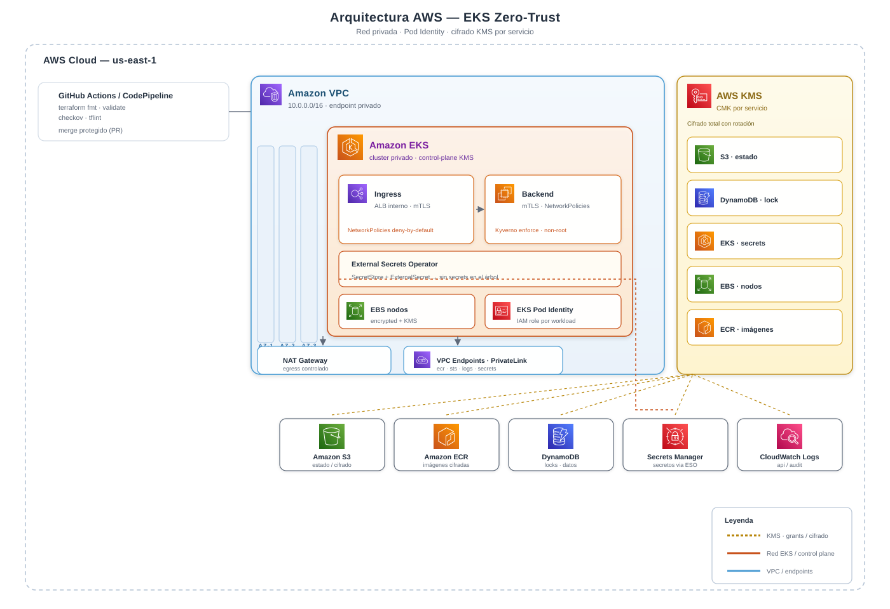

# AWS EKS Zero-Trust Architecture

[](https://www.terraform.io)
[](https://aws.amazon.com/eks)
[](https://www.nist.gov/publications/zero-trust-architecture)
[](https://github.com/features/actions)
[](https://www.checkov.io)
[](https://github.com/terraform-linters/tflint)
[](https://docs.github.com/code-security/dependabot)
[](SECURITY.md)

> **Zero-Trust en todas las capas**: red, identidad, cifrado y runtime. EKS 100% privado, cifrado con KMS dedicado por servicio y workloads con Pod Identity de mínimo privilegio.

Arquitectura **compleja** de AWS con **EKS privado** y modelo de seguridad **Zero-Trust** en todas las capas: red, identidad, cifrado y runtime. 100% provisionada con Terraform y con KMS como cifrado de todos los servicios.

<p align="center">
  
</p>

## Contenido

| Capa | Qué se aplica |
|---|---|
| **KMS (cifrado total)** | Un CMK por servicio: S3 (estado), DynamoDB (locks), EKS secrets, EBS nodos, ECR imágenes, Secrets Manager, CloudWatch Logs. Rotación automática. |
| **Red (perimeter)** | Cluster con endpoint `private` (sin acceso público), subredes privadas, NAT, VPC Endpoints (sin egress a Internet público para datos). |
| **Identidad (workloads)** | **EKS Pod Identity**: cada servicio tiene su propio IAM Role (mínimo privilegio). Sin secretos en el pod. |
| **Runtime (pods)** | NetworkPolicies **deny-by-default** (Cilium/Calico), Kyverno enforcement (non-root, no privileged, readOnlyRootFS, resource limits, seccomp), Pod Security Standards `restricted`. |
| **Datos** | Secrets via **External Secrets Operator** ← AWS Secrets Manager (KMS). Nodos con EBS `encrypted=true` + `kms_key_id`. |
| **IMDS** | `IMDSv2 required` en el launch template de los nodos. |
| **CI/CD** | GitHub Actions con Terraform `fmt/validate` + **Checkov** + **TFLint**. |

## Estructura

```
eks-zero-trust-portfolio/
├── terraform/
│   ├── main.tf          # Orquesta: KMS, VPC, EKS, Pod Identity
│   ├── variables.tf / outputs.tf
│   └── modules/
│       ├── kms/         # CMK por servicio con grants
│       ├── vpc/         # VPC privada + NAT + endpoints
│       ├── eks/         # Cluster privado + node groups + addons + IMDSv2
│       └── irsa/        # Saga Pod Identity por workload
├── k8s/
│   ├── namespace/       # app + security (Pod Security restricted)
│   ├── network-policies/ # default-deny + allow declarativo
│   ├── kyverno/         # Admission policies enforce
│   ├── external-secrets/ # SecretStore + ExternalSecret
│   └── app/             # Deployment de ejemplo (non-root, readOnlyRootFS)
├── docs/
│   └── architecture.svg # Diagrama con iconos oficiales AWS
├── SECURITY.md          # Política de divulgación responsable
└── .github/             # CI (checkov + tflint + validate) + dependabot
```

## Requisitos

- Terraform >= 1.5
- AWS CLI autenticado
- Backend S3 + DynamoDB (crearlos una vez, con los KMS keys `eks-zero-trust-s3` y `eks-zero-trust-ddb` ya provistos por este código)

## Despliegue

```bash
# 1) Preparar el bucket de estado + lock (una sola vez)
#    - S3 bucket: eks-zero-trust-state (SSE-KMS con alias eks-zero-trust-s3)
#    - DynamoDB:  eks-zero-trust-lock (partition key "LockID")

# 2) Aplicar la infraestructura
cd terraform
terraform init
terraform plan -out plan.out
terraform apply plan.out

# 3) Conectar kubectl (desde el bastion/host autorizado en la VPC)
aws eks update-kubeconfig --name eks-zero-trust --region us-east-1

# 4) Desplegar workloads de ejemplo
kubectl apply -f ../k8s/

# 5) Instalar addons seguros (una vez)
kubectl apply -f ../k8s/kyverno/          # require Kyverno instalado
kubectl apply -f ../k8s/network-policies/ # requiere Cilium o Calico
```

## Zero-Trust aplicado (checklist de seguridad)

- [x] EKS con **endpoint_public_access=false**
- [x] Secrets del control-plane cifrados con **CMK dedicado**
- [x] EBS de nodos **encrypted + KMS**
- [x] ECR imágenes **cifradas con KMS**
- [x] Secrets Manager **cifrado con KMS**
- [x] CloudWatch Logs (api/audit/authenticator) **cifrado con KMS**
- [x] **VPC Flow Logs** habilitados y cifrados con KMS
- [x] **IMDSv2 required** en nodos
- [x] **Pod Identity** por workload (trust confinada a `pods.eks.amazonaws.com` + `aws:SourceAccount`)
- [x] **Confused-deputy** mitigado: `aws:SourceAccount` en policies de KMS y trust de roles IAM
- [x] VPC Endpoints con **Security Group dedicado** (solo CIDR de la VPC)
- [x] NetworkPolicies **default-deny** (Ingress y Egress)
- [x] **Kyverno** enforce: non-root, no-privileged, readOnlyRootFS, resource limits, seccomp
- [x] Pod Security Standards `restricted`
- [x] External Secrets: nada de secrets en YAML ni en el árbol
- [x] CI: **Checkov + TFLint** antes de merge, acciones **pineadas a SHA**
- [x] **Dependabot** activo para GitHub Actions y Terraform
- [x] Política de divulgación en [SECURITY.md](SECURITY.md)

## Destrucción

```bash
cd terraform
terraform destroy   # respeta deletion_window de los KMS keys (7 dias)
```

> Nota: los CMKs tienen `deletion_window_in_days = 7`; al `terraform destroy` quedan `PendingDeletion` una semana (comportamiento real de AWS KMS).